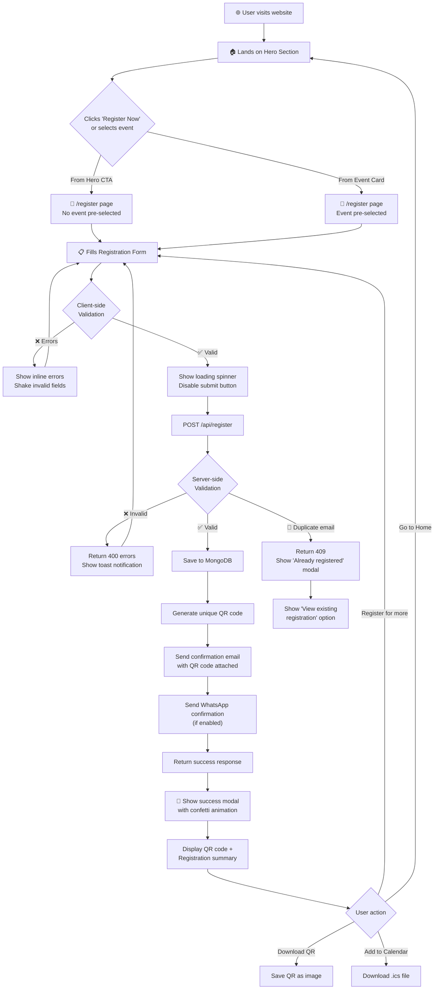
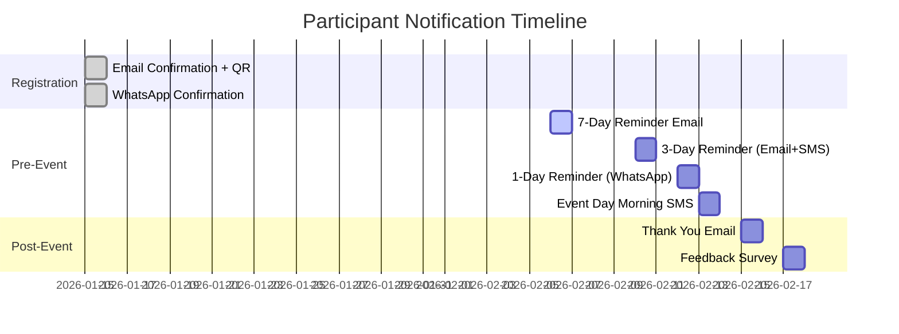

# 🎯 Registration Flow & UI/UX Experience — ICON 2026

> The complete user journey — from first landing to post-event engagement. Every interaction, notification, animation, and responsive behavior documented.

---

## 🔄 Registration Flow — End to End

### Visual Flow



---

### Step-by-Step Breakdown

#### Step 1: Discovery
- User lands on the website (via social media link, college WhatsApp group, Google search)
- Hero section grabs attention with animated particle background, countdown timer
- **Primary CTA**: "Register Now" button (gradient, pulsing glow)
- **Secondary CTA**: "Explore Events" button scrolls to event schedule section

#### Step 2: Event Exploration
- User scrolls to Event Schedule section or navigates to `/events`
- Browses events by category tabs (Technical / Non-Technical / Gaming)
- Clicks on an event card → opens **event detail modal**:
  - Event poster image
  - Full description
  - Date, Time, Venue
  - Team Size
  - Registration Fee & Prize Pool
  - Point of Contact (name, phone, email)
  - **"Register for this Event"** button

#### Step 3: Navigate to Registration
- Clicking "Register for this Event" → redirects to `/register?event=code-icon`
- The selected event is **pre-checked** in the event selection list
- If coming from Hero's "Register Now" → `/register` with no pre-selection

#### Step 4: Fill Registration Form
Form layout (desktop: 2 columns, mobile: 1 column):

```
┌─────────────────────────────────────────────────┐
│  📝 Register for ICON 2026                       │
│                                                  │
│  ┌──────────────────┐ ┌──────────────────┐      │
│  │ Full Name *       │ │ Email Address *  │      │
│  │ _________________ │ │ ________________ │      │
│  └──────────────────┘ └──────────────────┘      │
│                                                  │
│  ┌──────────────────┐ ┌──────────────────┐      │
│  │ Mobile Number *   │ │ College Name *   │      │
│  │ +91 _____________ │ │ ________________ │      │
│  └──────────────────┘ └──────────────────┘      │
│                                                  │
│  ┌──────────────────────────────────────────┐   │
│  │ Department (Optional)                     │   │
│  │ _________________________________________ │   │
│  └──────────────────────────────────────────┘   │
│                                                  │
│  Select Events * (minimum 1)                     │
│                                                  │
│  ┌─ Technical ──────────────────────────────┐   │
│  │ ☑ Code Icon (Hackathon)    ₹200          │   │
│  │ ☐ Debugging Challenge      ₹100          │   │
│  │ ☐ Web Dev Showdown         ₹150          │   │
│  │ ☐ Tech Quiz                ₹50           │   │
│  └──────────────────────────────────────────┘   │
│  ┌─ Non-Technical ──────────────────────────┐   │
│  │ ☐ Treasure Hunt            ₹100          │   │
│  │ ☐ Photography Contest      ₹50           │   │
│  │ ☐ Creative Writing         FREE          │   │
│  └──────────────────────────────────────────┘   │
│  ┌─ Gaming ─────────────────────────────────┐   │
│  │ ☐ BGMI                     ₹200          │   │
│  │ ☑ FIFA Tournament           ₹120          │   │
│  │ ☐ Pickleball               ₹200          │   │
│  └──────────────────────────────────────────┘   │
│                                                  │
│  ┌──────────────────────────────────────────┐   │
│  │ 2 events selected                        │   │
│  └──────────────────────────────────────────┘   │
│                                                  │
│         [ ✨ Complete Registration ]              │
│                                                  │
│  By registering, you agree to our terms.         │
└─────────────────────────────────────────────────┘
```

#### Step 5: Real-Time Validation
As the user fills each field:
- **Green check** ✅ appears when valid
- **Red shake** + inline error when invalid
- Email field checks format AND shows "Checking availability..." → "✅ Available" or "❌ Already registered"
- Mobile field auto-formats: `98765 43210`
- Event checkboxes update the **live count** at the bottom

#### Step 6: Form Submission
- User clicks "Complete Registration"
- Button transforms into a **loading spinner** (circular progress)
- All form fields become **disabled** (grayed out)
- API call happens in the background

#### Step 7: Success Celebration
- Modal slides up with **confetti particles** bursting from the center
- Shows:
  - ✅ "Registration Successful!"
  - Participant name and registration ID
  - **QR code** (unique to this registration — for event-day check-in)
  - List of selected events
  - "Download QR Code" button
  - "Add to Calendar" button (.ics download)
- QR code is also emailed to the participant

#### Step 8: Post-Registration Notifications
- **Email** sent within 30 seconds:
  - Subject: "🎉 You're registered for ICON 2026!"
  - Body: Event details, QR code image, venue map, contact info, calendar invite
- **WhatsApp** message (if enabled):
  - Registration confirmation with QR code image
- **SMS** (if enabled):
  - Short confirmation with registration ID

---

## ✨ UI/UX Microinteractions

### Form Field Interactions

| Interaction | Animation | Duration |
|-------------|-----------|----------|
| **Field focus** | Border animates from gray to gradient (crimson → blue), label floats up and shrinks | 200ms ease |
| **Valid input** | Green checkmark fades in to the right of the field | 150ms |
| **Invalid input** | Field border turns red, shakes horizontally (3 oscillations), error text slides down | 300ms |
| **Typing** | Subtle underline grows from center outward | continuous |
| **Checkbox select** | Check icon scales from 0 → 1 with a bounce, row gets a subtle gradient highlight | 250ms spring |
| **Event count update** | Number counts up/down with animated digit transition | 400ms |

### Button Interactions

| State | Visual |
|-------|--------|
| **Default** | Gradient background (crimson → blue), white text, rounded corners |
| **Hover** | Glow shadow expands outward, slight scale up (1.02), gradient shifts |
| **Active/Pressed** | Scale down (0.98), glow intensifies |
| **Loading** | Text fades out, circular spinner fades in, width shrinks to square |
| **Disabled** | Opacity 0.5, cursor not-allowed, no hover effects |
| **Success** | Background turns green, checkmark icon replaces spinner |

### Page-Level Animations

| Element | Animation | Trigger |
|---------|-----------|---------|
| **Navbar** | Slides down from top (translateY: -100% → 0) | Page load |
| **Navbar (scroll)** | Background blurs + darkens on scroll, hides on scroll-down, shows on scroll-up | Scroll |
| **Hero text** | Characters fade in one by one (typewriter effect) | Page load (delayed 0.5s) |
| **Countdown numbers** | Flip animation on each tick (like airport departure board) | Every second |
| **Section headings** | Slide up + fade in | Scroll into viewport |
| **Event cards** | Staggered fade-in (0.1s delay between each) | Scroll into viewport |
| **Event card hover** | Lifts (translateY: -8px), shadow deepens, border glows | Mouse hover |
| **Modal open** | Backdrop fades in, modal scales from 0.9 → 1 + fades in | Click event card |
| **Modal close** | Reverse of open | Click close/backdrop |
| **Gallery images** | Masonry layout with staggered load animation | Scroll into viewport |
| **Stats counter** | Numbers count up from 0 to target (1000+, 20+, etc.) | Scroll into viewport (once) |
| **Team cards** | Staggered fade-in + slide-up, hover flip reveals social links | Scroll into viewport |
| **Footer** | Subtle parallax — moves slightly slower than content | Scroll |
| **Page transitions** | Fade + slight slide (opacity 0→1, translateY 20→0) | Route change |
| **Loading screen** | ICON logo pulses + particle burst → fades to reveal page | Initial page load |

---

## 🔔 Notification System Design

### Notification Timeline



### Notification Details

#### 1. Registration Confirmation (Immediate — Email)
```
📧 Email
Subject: 🎉 You're registered for ICON 2026!

Hi {name},

Welcome to ICON 2026 — DATATRON! 🚀

Here's your registration summary:
━━━━━━━━━━━━━━━━━━━━━━━━━━━━━━━━
Registration ID: ICON2026-REG-00142
Events: Code Icon, FIFA Tournament
━━━━━━━━━━━━━━━━━━━━━━━━━━━━━━━━

📅 Date: February 13-14, 2026
📍 Venue: KJ Somaiya Institute of Management
🗺️ Vidyanagar, Vidya Vihar East, Mumbai - 400077

Your QR Code (show at venue for check-in):
[QR Code Image]

Add to your calendar: [.ics attachment]

Questions? Contact us:
📞 Ajil George: +91-8828279724
📧 icon.simsr@somaiya.edu

See you there! 🎮💻🏆
Team ICON
```

#### 2. Registration Confirmation (WhatsApp)
```
💬 WhatsApp

🎉 *ICON 2026 Registration Confirmed!*

Hi {name}! You're registered for:
• Code Icon (Hackathon)
• FIFA Tournament

📅 Feb 13-14, 2026
📍 KJSIM, Vidyavihar East, Mumbai

Your check-in QR code 👇
[QR Code Image]

Show this QR at the entrance!
```

#### 3. 3-Day Reminder (Email + SMS)
```
📧 Email
Subject: ⏰ ICON 2026 is in 3 days!

📱 SMS
"ICON 2026 starts Feb 13! Your events: Code Icon, FIFA.
Venue: KJSIM, Vidyavihar. Show QR at entry. See you! 🚀"
```

#### 4. 1-Day Reminder (WhatsApp)
```
💬 WhatsApp

⏰ *ICON 2026 is TOMORROW!*

Don't forget:
📍 KJ Somaiya Institute of Management
🕐 Gates open at 9:00 AM
📱 Keep your QR code ready for check-in

Need directions? 🗺️
https://maps.google.com/?q=KJSIM+Vidyavihar

See you there! 🚀
```

#### 5. Admin Broadcast (Custom)
```
Admin can compose a custom message and send via:
☑️ Email (to all / by event)
☑️ SMS (to all / by event)
☑️ WhatsApp (to all / by event)

Example: "⚠️ SCHEDULE CHANGE: The hackathon has been moved to Lab 301."
```

#### 6. Post-Event Thank You (Email)
```
📧 Email
Subject: 🙏 Thank you for being part of ICON 2026!

Hi {name},

Thank you for making ICON 2026 unforgettable!

📸 Event photos are live:
[View Gallery]

📝 Help us improve — share your feedback:
[Feedback Form]

Until next time! 🎉
Team ICON
```

### In-App Toast Notifications

| Event | Toast Style | Duration | Position |
|-------|------------|----------|----------|
| Registration success | ✅ Green toast | 5s | Top-right |
| Registration error | ❌ Red toast | 5s | Top-right |
| Duplicate email | ⚠️ Amber toast | 5s | Top-right |
| Contact form sent | ✅ Green toast | 4s | Top-right |
| Network error | ❌ Red toast | 6s | Top-right |
| Event added to selection | ℹ️ Blue toast | 2s | Bottom-center |
| QR scan success | ✅ Green toast | 3s | Top-center |
| QR scan duplicate | ⚠️ Amber toast | 4s | Top-center |
| QR scan invalid | ❌ Red toast | 4s | Top-center |

---

## 📱 Responsive Design Specifications

### Breakpoint Behavior

#### Navbar
| Breakpoint | Behavior |
|-----------|----------|
| **Desktop (≥1024px)** | Full horizontal nav: Somaiya logo → nav links → ICON logo. Sticky on scroll with glassmorphism backdrop. |
| **Tablet (640–1023px)** | Somaiya logo + hamburger icon. ICON logo moves to drawer. |
| **Mobile (<640px)** | Compact Somaiya logo + hamburger. Full-screen slide-in drawer with nav links, social icons, and "Register" CTA button. |

#### Hero Section
| Breakpoint | Behavior |
|-----------|----------|
| **Desktop** | Full viewport height. Large "ICON 2026" text (6rem). Countdown in horizontal row. Two CTA buttons side-by-side. |
| **Tablet** | 90vh height. Text (4rem). Countdown horizontal. CTAs side-by-side. |
| **Mobile** | 100vh with slight overflow. Text (2.5rem). Countdown 2×2 grid. CTAs stacked vertically, full-width. |

#### Event Cards Grid
| Breakpoint | Columns | Card Size |
|-----------|---------|-----------|
| **Desktop (≥1024px)** | 3 columns | Large cards with poster + full details |
| **Tablet (640–1023px)** | 2 columns | Medium cards, truncated description |
| **Mobile (<640px)** | 1 column | Full-width cards, swipeable |

#### Registration Form
| Breakpoint | Layout |
|-----------|--------|
| **Desktop** | 2-column: Form (left 60%) + Illustration/info (right 40%) |
| **Tablet** | 2-column with narrower illustration |
| **Mobile** | Single column, illustration hidden, full-width fields |

#### Team ICON Page
| Breakpoint | Columns |
|-----------|---------|
| **Desktop (≥1024px)** | 4 columns per row |
| **Tablet (640–1023px)** | 3 columns per row |
| **Mobile (<640px)** | 2 columns per row |

#### Live Streaming Page
| Breakpoint | Layout |
|-----------|--------|
| **Desktop** | Stream (70%) + Schedule sidebar (30%) side-by-side |
| **Tablet** | Stream (full-width) + Schedule below |
| **Mobile** | Stream (full-width) + Collapsible schedule accordion |

#### Admin Dashboard
| Breakpoint | Layout |
|-----------|--------|
| **Desktop** | Stats cards row + charts (2-column) + table (full-width) |
| **Tablet** | Stats cards (2×2) + charts stacked + table (horizontal scroll) |
| **Mobile** | Stats stacked + charts stacked + table (horizontal scroll) |

#### Footer
| Breakpoint | Layout |
|-----------|--------|
| **Desktop** | 3-column: ICON info | Useful Links | Contact |
| **Tablet** | 3-column, narrower |
| **Mobile** | Single column, stacked sections |

---

## ♿ Accessibility (a11y)

| Requirement | Implementation |
|-------------|---------------|
| **Color Contrast** | Minimum 4.5:1 ratio (WCAG AA) for all text |
| **Focus Indicators** | Visible focus rings on all interactive elements |
| **Keyboard Navigation** | All buttons, links, form fields, and modals navigable via Tab/Shift+Tab |
| **Screen Reader** | ARIA labels on icons, ARIA live regions for toasts, ARIA-expanded on dropdowns |
| **Alt Text** | All images have descriptive `alt` attributes |
| **Skip Navigation** | "Skip to main content" link for keyboard users |
| **Reduced Motion** | `prefers-reduced-motion` media query disables all animations |
| **Form Labels** | All inputs have visible labels (not just placeholders) |
| **Error Announcements** | Form errors announced via `aria-live="polite"` |

---

## 🗓️ Complete User Experience Timeline

```
PRE-EVENT (Weeks Before)
━━━━━━━━━━━━━━━━━━━━━━━
  📣 User discovers ICON via social media / college WhatsApp
  🌐 Visits website → wow'd by hero animation + countdown
  📖 Reads about DATATRON theme and events
  🎮 Browses event categories, reads descriptions
  👥 Checks out Team ICON page — sees who's organizing
  📝 Registers for 2 events → gets confirmation email + QR code
  💬 Receives WhatsApp confirmation with QR
  📅 Adds to calendar via .ics download

PRE-EVENT (Days Before)
━━━━━━━━━━━━━━━━━━━━━━━
  📧 Receives 7-day reminder email
  📱 Receives 3-day SMS reminder
  💬 Receives 1-day WhatsApp reminder with venue map

EVENT DAY
━━━━━━━━━
  📱 Shows QR code at entry → volunteer scans at /checkin → ✅ checked in
  📊 Admin monitors live check-in count on analytics dashboard
  🎥 Remote attendees watch live stream on /live page
  🎯 Participates in events

POST-EVENT
━━━━━━━━━━
  📧 Receives thank-you email
  📸 Views event photos in gallery
  📝 Fills feedback survey
```
