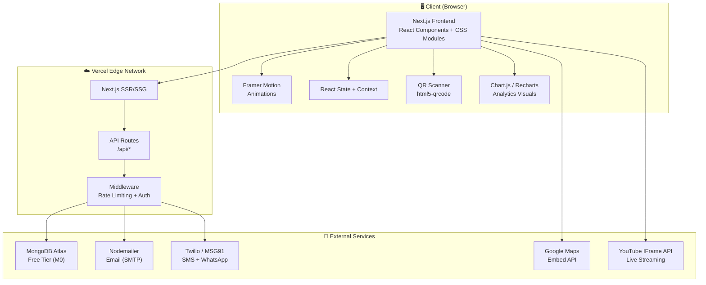
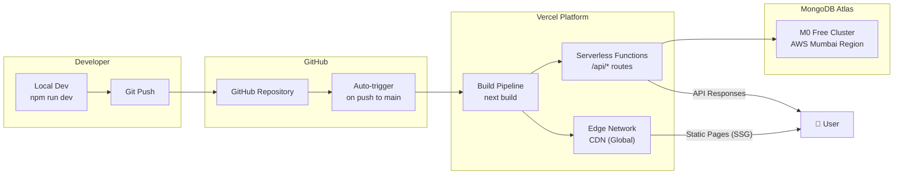

# 🛠️ Tech Stack & System Architecture — ICON 2026

> Complete technical blueprint covering every technology, library, service, and architectural decision for the ICON KJSIM full-stack website.

---

## 🏛️ Architecture Overview



---

## 📦 Complete Tech Stack

### Frontend

| Technology | Version | Purpose | Why This? |
|-----------|---------|---------|-----------|
| **Next.js** | 14.x (App Router) | Full-stack React framework | SSR/SSG for SEO, file-based routing, built-in API routes, image optimization, Vercel-native |
| **React** | 18.x | UI library | Component-based, massive ecosystem, industry standard |
| **Vanilla CSS + CSS Modules** | — | Styling | Zero runtime cost, full control, component-scoped via `.module.css`, no dependency bloat |
| **Framer Motion** | 11.x | Animations | Best React animation library — scroll triggers, layout animations, page transitions, gesture support |
| **Chart.js + react-chartjs-2** | 4.x | Analytics charts | Bar, line, pie charts for the admin analytics dashboard |
| **React Icons** | 5.x | Icon set | Tree-shakeable, includes Lucide/FontAwesome/Material sets |
| **React Hot Toast** | 2.x | Toast notifications | Lightweight, beautiful defaults, customizable |
| **html5-qrcode** | 2.x | QR code scanning | Browser-based camera QR scanner for event-day check-in |
| **qrcode** | 1.x | QR code generation | Generate unique QR codes for each registration |
| **Google Fonts** | — | Typography | `Outfit` (headings), `Inter` (body), `Space Grotesk` (numbers/accents) |

### Backend

| Technology | Version | Purpose | Why This? |
|-----------|---------|---------|-----------|
| **Next.js API Routes** | 14.x | REST API | Runs on the same deployment as frontend, serverless, no separate hosting needed |
| **Mongoose** | 8.x | MongoDB ODM | Schema validation, middleware hooks, clean query API, population support |
| **MongoDB Atlas** | 7.x (M0 Free) | Database | Cloud-hosted, 512MB free storage, auto-scaling, built-in backups, global clusters |
| **bcryptjs** | 2.x | Password hashing | For admin panel authentication |
| **jsonwebtoken** | 9.x | JWT tokens | Stateless admin session management |
| **zod** | 3.x | Validation | TypeScript-first schema validation for API inputs — safer than manual checks |

### Communication & Notifications

| Technology | Purpose | Why This? |
|-----------|---------|-----------|
| **Nodemailer** | Sending emails | Registration confirmations, reminders, broadcast messages |
| **Gmail SMTP** or **Resend** | Email transport | Free for low volume, reliable delivery |
| **Twilio** | SMS + WhatsApp notifications | Industry standard, excellent API, supports Indian numbers, WhatsApp Business API |
| **MSG91** (alternative) | SMS gateway | India-focused, cheaper for high-volume SMS, DLT compliant |

### Live Streaming

| Technology | Purpose | Why This? |
|-----------|---------|-----------|
| **YouTube IFrame API** | Embed live stream | Most events stream on YouTube — embed directly with controls |
| **WebSocket (optional)** | Custom live chat | For building a custom chat alongside the stream |

### DevOps & Deployment

| Technology | Purpose | Why This? |
|-----------|---------|-----------|
| **Vercel** | Hosting (frontend + API) | Native Next.js support, free tier (100GB bandwidth), instant Git deploys, edge network, serverless functions |
| **GitHub** | Version control | Required per submission, CI/CD integration with Vercel |
| **MongoDB Atlas** | Database hosting | Paired with Vercel's serverless — no server to manage |
| **Vercel Analytics** | Performance monitoring | Free, built-in Web Vitals tracking |

### Development Tools

| Tool | Purpose |
|------|---------|
| **ESLint** | Code linting |
| **Prettier** | Code formatting |
| **Postman / Thunder Client** | API testing |
| **MongoDB Compass** | Database GUI |

---

## 🗄️ Database Schema Design

### Collection: `registrations`

```javascript
{
  _id:          ObjectId,
  name:         String,        // "Farhan Khan"
  email:        String,        // "farhan@example.com" (unique index)
  mobile:       String,        // "9876543210"
  college:      String,        // "KJ Somaiya Institute of Management"
  department:   String,        // "Data Science & Technology" (optional)
  events:       [String],      // ["Code Icon", "BGMI", "FIFA"]
  
  // QR Check-in
  qrCode:         String,      // unique QR identifier: "ICON2026-REG-00142"
  checkedIn:      Boolean,     // QR check-in status (default: false)
  checkedInAt:    Date,        // timestamp of check-in (null if not checked in)
  checkedInBy:    String,      // volunteer name who scanned (optional)
  
  // Notification tracking
  confirmationSent:   Boolean, // default: false
  reminderSent:       Boolean, // default: false
  whatsappSent:       Boolean, // default: false
  
  createdAt:      Date,        // auto
  updatedAt:      Date         // auto
}
```

**Indexes:**
- `email` → unique index (prevents duplicate registrations)
- `mobile` → index (for quick lookup)
- `qrCode` → unique index (for fast QR scan validation)
- `checkedIn` → index (for live check-in count queries)
- `createdAt` → index (for time-based analytics)

---

### Collection: `events`

```javascript
{
  _id:          ObjectId,
  name:         String,        // "Code Icon"
  slug:         String,        // "code-icon" (URL-safe, unique)
  category:     String,        // "technical" | "non-technical" | "gaming"
  description:  String,        // Full event description
  shortDesc:    String,        // One-liner for cards
  
  date:         Date,          // "2026-02-13"
  time:         String,        // "10:00 AM - 4:00 PM"
  venue:        String,        // "KJSIM Lab-205"
  
  registrationFee:  Number,    // 200 (in INR)
  prizePool:        Number,    // 2000 (in INR)
  teamSize:         String,    // "Solo" | "2-4 members" | "3-5 members"
  maxParticipants:  Number,    // capacity limit (null = unlimited)
  
  posterImage:  String,        // "/images/events/code-icon.png"
  rules:        [String],      // Array of rules
  
  // Live streaming
  streamUrl:    String,        // YouTube live URL (null if not streaming)
  isLive:       Boolean,       // currently streaming? (default: false)
  
  poc: {                       // Point of Contact
    name:   String,            // "Mohammad Harnekar"
    phone:  String,            // "8433549779"
    email:  String             // "m.harnekar@somaiya.edu"
  },
  
  isActive:     Boolean,       // show/hide event
  createdAt:    Date,
  updatedAt:    Date
}
```

---

### Collection: `contacts`

```javascript
{
  _id:        ObjectId,
  name:       String,          // optional
  email:      String,
  message:    String,
  isRead:     Boolean,         // default: false
  createdAt:  Date
}
```

---

### Collection: `notifications_log`

```javascript
{
  _id:          ObjectId,
  type:         String,        // "email" | "sms" | "whatsapp"
  recipient:    String,        // email or phone number
  subject:      String,        // email subject (null for SMS)
  content:      String,        // message content / template name
  status:       String,        // "sent" | "failed" | "pending"
  registrationId: ObjectId,   // ref → registrations (optional)
  isBroadcast:  Boolean,      // was this a bulk broadcast?
  error:        String,        // error message if failed
  sentAt:       Date
}
```

---

### Collection: `team_members`

```javascript
{
  _id:          ObjectId,
  name:         String,        // "Farhan Khan"
  role:         String,        // "Lead Developer"
  team:         String,        // "Development Team" | "Organizing Committee" | "Core Committee" | "Faculty"
  photo:        String,        // "/images/team/farhan.jpg"
  bio:          String,        // Short bio
  linkedin:     String,        // LinkedIn URL
  email:        String,
  instagram:    String,        // Instagram URL
  order:        Number,        // display order within team
  isActive:     Boolean,       // show/hide
  createdAt:    Date
}
```

---

## 🔌 API Endpoint Specifications

### Registration API

#### `POST /api/register` — Submit Registration

**Request Body:**
```json
{
  "name": "Farhan Khan",
  "email": "farhan@example.com",
  "mobile": "9876543210",
  "college": "KJ Somaiya Institute of Management",
  "department": "Data Science",
  "events": ["Code Icon", "BGMI"]
}
```

**Validation (Zod):**
```javascript
const RegistrationSchema = z.object({
  name:       z.string().min(2).max(100).trim(),
  email:      z.string().email().toLowerCase(),
  mobile:     z.string().regex(/^[6-9]\d{9}$/, "Invalid Indian mobile number"),
  college:    z.string().min(2).max(200),
  department: z.string().optional(),
  events:     z.array(z.string()).min(1, "Select at least one event"),
});
```

**Success Response (201):**
```json
{
  "success": true,
  "message": "Registration successful!",
  "data": {
    "id": "665a1b2c3d4e5f6a7b8c9d0e",
    "name": "Farhan Khan",
    "email": "farhan@example.com",
    "events": ["Code Icon", "BGMI"],
    "qrCode": "ICON2026-REG-00142"
  }
}
```

**Error Responses:**
| Status | Condition | Response |
|--------|-----------|----------|
| 400 | Validation failed | `{ "success": false, "errors": [{ "field": "mobile", "message": "Invalid Indian mobile number" }] }` |
| 409 | Duplicate email | `{ "success": false, "message": "This email is already registered" }` |
| 500 | Server error | `{ "success": false, "message": "Internal server error" }` |

---

#### `GET /api/register` — Fetch All Registrations (Admin)

**Headers:** `Authorization: Bearer <admin-jwt-token>`

**Query Params:** `?page=1&limit=20&event=BGMI&search=farhan`

**Response (200):**
```json
{
  "success": true,
  "data": {
    "registrations": [...],
    "pagination": {
      "total": 156,
      "page": 1,
      "limit": 20,
      "totalPages": 8
    }
  }
}
```

---

#### `POST /api/checkin` — QR Code Check-in

**Request:** `{ "qrCode": "ICON2026-REG-00142" }`

**Responses:**
| Status | Condition | Response |
|--------|-----------|----------|
| 200 | Success | `{ "success": true, "participant": { "name": "Farhan Khan", "events": [...] }, "message": "Checked in!" }` |
| 200 | Already checked in | `{ "success": false, "alreadyCheckedIn": true, "checkedInAt": "...", "message": "Already checked in" }` |
| 404 | Invalid QR | `{ "success": false, "message": "Registration not found" }` |

---

#### `GET /api/analytics` — Dashboard Analytics (Admin)

**Headers:** `Authorization: Bearer <admin-jwt-token>`

**Response (200):**
```json
{
  "success": true,
  "data": {
    "totalRegistrations": 156,
    "totalCheckedIn": 89,
    "registrationsByEvent": [
      { "event": "Code Icon", "count": 45 },
      { "event": "BGMI", "count": 32 }
    ],
    "registrationsByDate": [
      { "date": "2026-01-15", "count": 12 },
      { "date": "2026-01-16", "count": 8 }
    ],
    "collegeDistribution": [
      { "college": "KJSIM", "count": 67 },
      { "college": "Other", "count": 89 }
    ],
    "checkinTimeline": [
      { "time": "09:00", "count": 15 },
      { "time": "09:30", "count": 28 }
    ]
  }
}
```

---

#### `POST /api/notify/broadcast` — Send Broadcast Notification (Admin)

**Request:**
```json
{
  "channel": "email",
  "subject": "Schedule Update — ICON 2026",
  "message": "The hackathon has been moved to Lab 301.",
  "targetEvent": "Code Icon"
}
```

---

#### `POST /api/contact` — Submit Contact Message

**Request:** `{ "email": "user@example.com", "message": "Is accommodation available?" }`

**Response:** `{ "success": true, "message": "Message received! We'll get back to you soon." }`

---

#### `GET /api/events` — Fetch Events List

**Query Params:** `?category=technical&active=true`

**Response:**
```json
{
  "success": true,
  "data": [
    {
      "name": "Code Icon",
      "slug": "code-icon",
      "category": "technical",
      "shortDesc": "48-hour hackathon challenge",
      "date": "2026-02-13",
      "registrationFee": 200,
      "prizePool": 5000,
      "teamSize": "2-4 members",
      "isLive": false,
      "streamUrl": null
    }
  ]
}
```

---

#### `GET /api/stream` — Get Live Stream Info

**Response:**
```json
{
  "success": true,
  "data": {
    "isLive": true,
    "currentEvent": "Code Icon Hackathon — Final Presentations",
    "streamUrl": "https://youtube.com/live/xxxxx",
    "schedule": [
      { "time": "09:00", "event": "Opening Ceremony", "status": "completed" },
      { "time": "10:00", "event": "Hackathon Starts", "status": "live" },
      { "time": "16:00", "event": "Prize Distribution", "status": "upcoming" }
    ]
  }
}
```

---

## 🔐 Environment Variables

```env
# .env.local (NEVER commit this file)

# MongoDB
MONGODB_URI=mongodb+srv://<user>:<password>@cluster0.xxxxx.mongodb.net/icon2026?retryWrites=true&w=majority

# Admin
ADMIN_PASSWORD=your-secure-admin-password
JWT_SECRET=your-jwt-secret-key-min-32-chars

# Email (Nodemailer)
SMTP_HOST=smtp.gmail.com
SMTP_PORT=587
SMTP_USER=icon.simsr@somaiya.edu
SMTP_PASS=your-app-password

# SMS & WhatsApp (Twilio)
TWILIO_ACCOUNT_SID=your-account-sid
TWILIO_AUTH_TOKEN=your-auth-token
TWILIO_PHONE_NUMBER=+1234567890
TWILIO_WHATSAPP_NUMBER=whatsapp:+14155238886

# App
NEXT_PUBLIC_APP_URL=https://icon-kjsim.vercel.app
```

---

## 🚀 Deployment Architecture



### Deployment Steps
1. Push code to GitHub `main` branch
2. Vercel auto-detects Next.js → runs `next build`
3. Static pages are pre-rendered and served from CDN edge nodes
4. API routes become serverless functions (AWS Lambda under the hood)
5. Environment variables configured in Vercel dashboard
6. MongoDB Atlas cluster in AWS Mumbai region for low latency

### Performance Optimizations
| Technique | Implementation |
|-----------|---------------|
| **Image Optimization** | `next/image` with automatic WebP conversion, lazy loading, blur placeholders |
| **Static Generation** | Home, Events, Sponsors, Team pages pre-rendered at build time (SSG) |
| **Code Splitting** | Automatic per-route code splitting by Next.js |
| **Font Optimization** | `next/font` for zero-layout-shift Google Font loading |
| **CSS Modules** | Zero unused CSS — only component-level styles are bundled |
| **MongoDB Connection Pooling** | Singleton connection pattern to avoid cold-start overhead |
| **API Response Caching** | `Cache-Control` headers on event/team data (changes rarely) |
| **Bundle Analysis** | `@next/bundle-analyzer` to identify and eliminate bloat |

### Security Measures
| Threat | Mitigation |
|--------|-----------|
| **XSS** | React auto-escapes JSX, no `dangerouslySetInnerHTML` |
| **CSRF** | Same-origin API routes, SameSite cookies |
| **Injection** | Mongoose schema validation + Zod input validation |
| **Rate Limiting** | Custom middleware: max 10 registrations per IP per hour |
| **Admin Access** | JWT-based auth with httpOnly cookies |
| **Env Secrets** | `.env.local` excluded from Git, Vercel encrypted env vars |
| **HTTPS** | Enforced by Vercel (automatic SSL) |

---

## 🔍 SEO Implementation

| Element | Implementation |
|---------|---------------|
| **Title** | `"ICON 2026 — DATATRON | KJSIM Techfest"` |
| **Meta Description** | `"ICON 2026 is the official techfest of KJ Somaiya Institute of Management. Theme: DATATRON. Register for hackathons, coding challenges, gaming events, and more."` |
| **Open Graph** | og:image with ICON poster, og:title, og:description for social sharing |
| **Twitter Card** | `summary_large_image` card for Twitter/X sharing |
| **Structured Data** | JSON-LD `Event` schema for Google rich results |
| **Sitemap** | Auto-generated `sitemap.xml` via `next-sitemap` |
| **Robots** | `robots.txt` allowing all crawlers |
| **Semantic HTML** | `<header>`, `<main>`, `<section>`, `<article>`, `<footer>`, proper `<h1>`→`<h6>` hierarchy |
| **Alt Text** | All images have descriptive alt text |
| **Canonical URLs** | Prevent duplicate content indexing |
